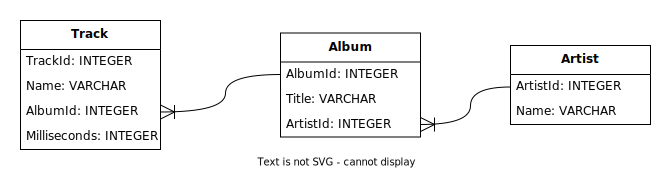
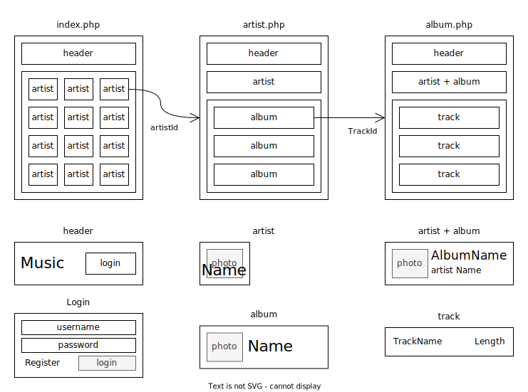

# LTW Example

Based on a simplified version of the [Chinook Database](https://github.com/lerocha/chinook-database):



You can see previous versions of the example by changing branches.

# Step 1: Create the Database

To create the database, we need to run the following command:

```bash
sqlite3 database.db < database.sql
```

# Step 2: Draw Mockups

Draw some initial mockups. Don't lose too much time with these:



# Step 3: HTML in PHP files

* [index.php](index.php)
* [artist.php](artist.php)
* [album.php](album.php)

# Step 4: Create template files

Create a [templates](templates) folder that will contain several template files.

Each template file will have functions that will be able to draw parts of the HTML:

* [common.tpl.php](templates/common.tpl.php) drawHeader, drawFooter, drawLoginForm.
* [artist.tpl.php](templates/artist.tpl.php) drawArtists, drawArtist.
* [album.tpl.php](templates/album.tpl.php) drawAlbum.